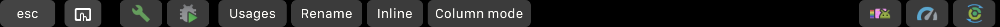

## What's in here?

This is my configuration file for the TouchBar and Android Studio.

It works with [BetterTouchTool](https://www.boastr.net)

## Here's how it looks

When you open Android Studio


Handy debugging shortcuts


And of course some run configurations


## How to use it

  * Get [BetterTouchTool](https://www.boastr.net)
  * Get the [config file](btt-android-studio-config.json?raw=true)
  * Import the config file into BTT by going to Preferences->Manage Presets->Import
  * Switch to Android Studio
  * Profit

## Known limitations

The current configuration is set to work with the Android Studio EAP.

### Support

Pull requests and issues are encouraged.
If you want to contribute to this configuration, please submit an issue first.

### License

```
Copyright 2017 Google, Inc.

Licensed to the Apache Software Foundation (ASF) under one or more contributor
license agreements. See the NOTICE file distributed with this work for
additional information regarding copyright ownership. The ASF licenses this
file to you under the Apache License, Version 2.0 (the "License"); you may not
use this file except in compliance with the License. You may obtain a copy of
the License at

http://www.apache.org/licenses/LICENSE-2.0

Unless required by applicable law or agreed to in writing, software
distributed under the License is distributed on an "AS IS" BASIS, WITHOUT
WARRANTIES OR CONDITIONS OF ANY KIND, either express or implied. See the
License for the specific language governing permissions and limitations under
the License.
```
